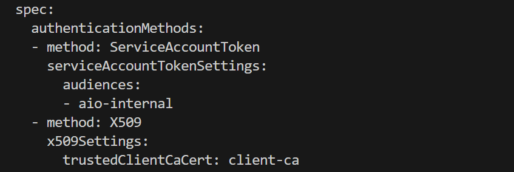

# Azure IoT Operations MQTT Broker with X-509 authentication Lab

This lab aims to configure the Azure IoT Operations MQTT Broker with X.509 authentication. It's updated to address version 0.7.31 of the Azure IoT Operations Preview.

References:
- https://learn.microsoft.com/en-us/azure/iot-operations/manage-mqtt-broker/howto-configure-authentication


## Concepts

### Broker

Check the existing broker.

```bash
kubectl get broker default -n azure-iot-operations -o yaml
```

## Listener

A listener corresponds to a network endpoint that exposes the broker to the network. Each listener can have its own authentication and authorization rules that define who can connect to the listener and what actions they can perform on the broker. You can use BrokerAuthentication and BrokerAuthorization resources to specify the access control policies for each listener. 

You can check the services being exposed, including the default `aio-broker` service:

```bash
kubectl get svc -n azure-iot-operations
```


Check the default listener:

```bash
kubectl get brokerlistener default -n azure-iot-operations -o yaml
```


It's using the default BrokerAuthentication (configured with `authenticationRef`) and we have TLS enabled using the provided certificate issuer `azure-iot-operations-aio-certificate-issuer`.

```bash
kubectl get brokerauthentication default -n azure-iot-operations -o yaml
```


We can see that by default the authentication method is only SAT (Service Account Token).


### Broker Authentication

BrokerListener and BrokerAuthentication are separate resources, but they're linked together using listenerRef. The following rules apply:

- A BrokerListener can be linked to only one BrokerAuthentication
- A BrokerAuthentication can be linked to multiple BrokerListeners
- Each BrokerAuthentication can support multiple authentication methods at once

### Server certificate

With automatic certificate management, you use cert-manager to manage the TLS server certificate. By default, cert-manager is installed alongside Azure IoT Operations Preview in the azure-iot-operations namespace already. 

## End to end test

### Step 1. Install Step CLI

Step CLI is a command line to quickly create self-signed or CA base certificates. This is used to manage the CA and issue certificates. You can install the tool from [Step CLI](https://smallstep.com/docs/step-cli/installation/).

```bash
wget https://dl.smallstep.com/cli/docs-cli-install/latest/step-cli_amd64.deb
sudo dpkg -i step-cli_amd64.deb
```

### Step 2. Setup an offline CA

To create the root and intermediate CA certificates run:

```bash
mkdir ca

export STEPPATH="$PWD/ca"

step ca init \
    --deployment-type standalone \
    --name MqttAppSamplesCA \
    --dns localhost \
    --address 127.0.0.1:443 \
    --provisioner MqttAppSamplesCAProvisioner
```

Follow the cli instructions, when done make sure you remember the password used to protect the private keys, by default the generated certificates and keys are stored in:

```bash
ca/certs/root_ca.crt
ca/certs/intermediate_ca.crt
ca/secrets/root_ca_key
ca/secrets/intermediate_ca_key
```

The CA certs are valid for 10 years.

### Step 3. Create Chain

```bash
# Not needed: cat ca/certs/root_ca.crt ca/certs/intermediate_ca.crt > chain.pem
cat ca/certs/root_ca.crt > client_ca.pem
```

### Step 4. Generate client certificate for an MQTT client using intermediate CA

```bash
step certificate create foo foo.crt foo.key \
      --ca ca/certs/intermediate_ca.crt \
      --ca-key ca/secrets/intermediate_ca_key \
      --no-password \
      --insecure \
      --not-after 2400h
```

### Step 5. Create config map with client root CA

A trusted root CA certificate is required to validate the client certificate. To import a root certificate that can be used to validate client certificates, first import the certificate PEM as ConfigMap under the key client_ca.pem. Client certificates must be rooted in this CA for Azure IoT MQ to authenticate them.

```bash
kubectl create configmap client-ca --from-file=client_ca.pem -n azure-iot-operations
```

Check it:

```bash
kubectl describe configmap client-ca -n azure-iot-operations
```

### Step 6. Create attributes file for Authorization

You can use this command to check the information in the certificates:

```bash
step certificate inspect ca/certs/root_ca.crt
step certificate inspect ca/certs/intermediate_ca.crt
step certificate inspect foo.crt
```

In alternative you can also use the `openssl` command:

```bash
openssl x509 -in ca/certs/root_ca.crt -text -noout
openssl x509 -in ca/certs/intermediate_ca.crt -text -noout
openssl x509 -in foo.crt -text -noout
```


### Step 7. Enable X.509 authentication in the BrokerAuthentication

Get your default BrokerAuthentication configuration that only uses sat:

```bash
kubectl get brokerauthentication default -n azure-iot-operations -o yaml > auth-default.yaml
```


Enable X.509 client authentication by adding it as one of the authentication methods as part of a BrokerAuthentication resource linked to a TLS-enabled listener. Copy file `auth-default.yaml`to a new file `auth-x509.yaml`. Add a section with X509m parameters:

```yaml
spec:
  authenticationMethods:
    - method: X509
      x509Settings:
        trustedClientCaCert: client-ca
        authorizationAttributes:
        # ...
```

And apply it:

```bash
kubectl apply -f auth-x509.yaml
```

Check again the new config:

```bash
kubectl get brokerauthentication default -n azure-iot-operations -o yaml
```




### Step 9. Create a CA file for the client

It needs both the client CA chain (root + intermediate) used for authentication and also the server CA root used for TLS.

```bash
# Get server root CA
kubectl get configmap azure-iot-operations-aio-ca-trust-bundle -n azure-iot-operations -o jsonpath='{.data.ca\.crt}' > server_ca.crt

# Create chain PEM
cat ca/certs/root_ca.crt ca/certs/intermediate_ca.crt server_ca.crt > chain_server_client.pem
```

### Step 10. Test with mosquitto

To test from within the cluster let's deploy a sample client pod:

```bash
kubectl apply -f mqtt-client.yaml
```

Copy certificate and key files into pod:

```bash
kubectl cp foo.crt azure-iot-operations/mqtt-client:/tmp/foo.crt
kubectl cp foo.key azure-iot-operations/mqtt-client:/tmp/foo.key
kubectl cp chain_server_client.pem azure-iot-operations/mqtt-client:/tmp/chain_server_client.pem
```

Open a shell into this pod to run commands:

```bash
kubectl exec --stdin --tty mqtt-client -n azure-iot-operations -- sh
```

And run this comand to publish messages:

```bash
mosquitto_pub -q 1 -t hello -d -V mqttv5 -m world2 -i thermostat -h aio-broker -p 18883 --cert /tmp/foo.crt --key /tmp/foo.key --cafile /tmp/chain_server_client.pem
```


Open another shell into the pod:

```bash
kubectl exec --stdin --tty mqtt-client -n azure-iot-operations -- sh
```

And run the `mosquitto_sub` tool to check the published messages:

```bash
mosquitto_sub -t hello -d -V mqttv5 -h aio-broker -p 18883 --cert /tmp/foo.crt --key /tmp/foo.key --cafile /tmp/chain_server_client.pem
```


MQTTUI doesn't not work for now to check the published messages:

```bash
mqttui -b mqtts://aio-broker:18883 -u '$sat' --password $(cat /var/run/secrets/tokens/broker-sat) --insecure
```


### Step 11. Expose service to the outside

The default the broker `aio-broker` only has an internal Cluster IP.

```bash
k get svc -n azure-iot-operations
```


To expose it you need to change the listener replacing the service type from ClusterIp to LoadBalancer:

```bash
kubectl patch brokerlistener default -n azure-iot-operations --type='json' -p='[{"op": "replace", "path": "/spec/serviceType", "value": "loadBalancer"}]'
```

Wait for the service to be updated:

```bash
kubectl get service aio-broker -n azure-iot-operations
```


### Step 12. Test from outside

Publish a message from outside the cluster:

```bash
mosquitto_pub -q 1 -t hello -d -V mqttv5 -m "world3 from outside" -i thermostat -h 10.0.0.4 -p 18883 --cert foo.crt --key foo.key --cafile chain_server_client.pem
```

You can also use Port forwarding like describe [here](https://learn.microsoft.com/en-us/azure/iot-operations/manage-mqtt-connectivity/howto-test-connection#use-port-forwarding).


### Step 13. Test with a nodejs sample client

Just use sample in folder `node-app-test-client`.


## Broker Listerer TLS manual configuration

In case you need to replace the by default certificate used by TLS that only includes the cluster IP and the node IP, with a certificate that includes the DNS name of the broker and can also include a public IP if needed, you can follow these [steps](docs/tls-manual.md).