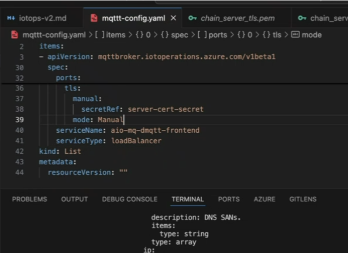

# Configure Broker Listener TLS manually

The goal is to replace the by default certificate used by TLS that only includes the cluster IP and the node IP with a certificate that includes the DNS name of the broker and can also include a public IP if needed.

This is based in the [Azure IoT Operations documentation](https://learn.microsoft.com/en-us/azure/iot-operations/manage-mqtt-broker/howto-configure-tls-manual).


## Step 1. Create a server certificate for the MQTTS listener:

```bash
step certificate create mqtts-endpoint mqtts-endpoint.crt mqtts-endpoint.key \
--profile leaf \
--not-after 8760h \
--san mqtts-endpoint \
--san localhost \
--ca intermediate_ca.crt --ca-key intermediate_ca.key \
--no-password --insecure
```

## Step 2. Create a full server chain

cat  mqtts-endpoint.crt intermediate_ca.crt  > server_chain.pem

Import server certificate chain as a Kubernetes secret

kubectl create secret tls server-cert-secret -n azure-iot-operations \
--cert server_chain.crt \
--key mqtts-endpoint.key


## Step 3. Enable TLS for a listener

Modify the BrokerListener configuration to use the new certificate:

```yaml	
apiVersion: mqttbroker.iotoperations.azure.com/v1beta1
kind: BrokerListener
metadata:
  name: manual-tls-listener
  namespace: azure-iot-operations
spec:
  brokerRef: broker
  serviceType: loadBalancer # Optional, defaults to clusterIP
  serviceName: mqtts-endpoint # Match the SAN in the server certificate
  ports:
    port: 8885 # Avoid port conflict with default listener at 8883
    tls:
      manual:
        secretRef: server-cert-secret
      mode: Manual
```

Sample configuration (the documentation is not quite accurate on this)



Apply the new configuration:

```bash
kubectl apply -f manual-tls-listener.yaml
```
